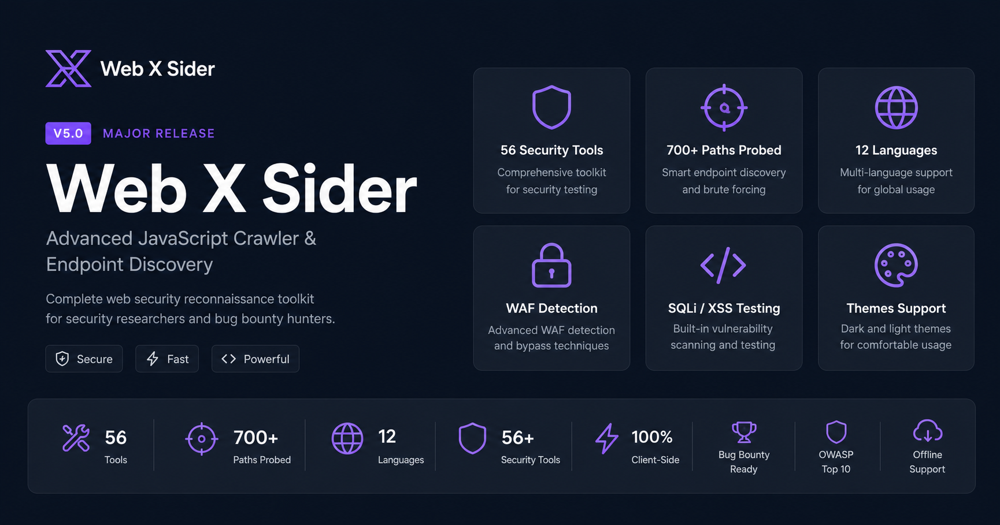

<div align="center">



# Web X Sider

**Advanced JavaScript Crawler, Endpoint Discovery & Bug Bounty Toolkit**

[](https://github.com/jojin1709/Web-X-Sider)
[](LICENSE)
[](https://github.com/jojin1709/Web-X-Sider)
[](https://github.com/jojin1709/Web-X-Sider/issues)

The ultimate client-side reconnaissance tool for security researchers. Extract hidden API routes, sensitive parameters, and hardcoded secrets instantly from any website — directly in your browser.

**[Live Demo](https://web-x-sider.mmkoji856.workers.dev)** · **[Report Bug](https://github.com/jojin1709/Web-X-Sider/issues)** · **[Request Feature](https://github.com/jojin1709/Web-X-Sider/issues)**

---

</div>

## Table of Contents

- [What is Web X Sider?](#what-is-web-x-sider)
- [Features](#features)
- [Quick Start](#quick-start)
- [56+ Tools Overview](#56-tools-overview)
- [Architecture](#architecture)
- [Proxy Setup](#proxy-setup)
- [Keyboard Shortcuts](#keyboard-shortcuts)
- [Supported Languages](#supported-languages)
- [Contributing](#contributing)
- [License](#license)
- [Credits](#credits)

---

## What is Web X Sider?

Web X Sider is a **100% client-side** reconnaissance tool designed for bug bounty hunters and security researchers. It runs entirely in your browser — no data is sent to external servers.

### Why Web X Sider Exists

In bug bounty hunting, reconnaissance is 80% of the work. Web X Sider automates the tedious parts:

- **JavaScript Analysis** — Extract endpoints, secrets, and parameters from JS files
- **Sensitive Path Discovery** — 700+ paths across 44 categories
- **Security Testing** — SQL injection, XSS, command injection, and more
- **WAF Detection** — Identify which protection is in place before testing

All **76 tools** run instantly in your browser with zero external dependencies.

---

## Features

| Category | Tools | Description |
|----------|-------|-------------|
| **Core Scanner** | 20 | JS crawling, endpoint discovery, secret detection, 17 recon sub-checks |
| **Smart Prober** | 1 | 700+ sensitive paths across 44 categories |
| **Toolkit v1** | 10 | JS Diff Monitor, JWT Lab, Subdomain Takeover, CVE Map, Batch Scan, IDOR, Auth Matrix, Webhooks, Snapshots, PDF Export |
| **Toolkit v2** | 8 | Race Condition, GraphQL Explorer, OAuth/PKCE, Request Smuggling, Prototype Pollution, Cache Poisoning, Bucket Enumeration, Nuclei Templates |
| **Toolkit v3** | 25 | WAF Detection, Subdomain Enum, Open Redirect, Rate Limiting, Port Scan, Backup Finder, HTTP Methods, Clickjacking, Headers, SQLi, XSS, CMDi, Traversal, WebSocket, API Version, JWT Enhanced, OAuth, DNS Security, Email Security, Cloud Storage, Container, CI/CD, Mobile, Collaboration |
| **Toolkit v4** | 13 | Dashboard, Reports, History, Targets, Shortcuts, Wordlist Manager, Scan Profiles, Alerts, OWASP/PCI/NIST Compliance, API Integration, i18n, Themes, Accessibility |

### Key Capabilities

- **100% Client-Side** — No data leaves your browser
- **76 Integrated Tools** — Complete bug bounty toolkit
- **12 Languages** — Full UI translation support
- **Dark/Light Themes** — Customize your workspace
- **Offline Support** — Works without internet (Service Worker)
- **Export Multiple Formats** — JSON, CSV, HTML, PDF, Nuclei YAML, Burp XML, ffuf, sqlmap, HAR
- **Compliance Checks** — OWASP Top 10, PCI DSS, NIST framework assessments
- **Wordlist Management** — Upload, save, and manage custom wordlists
- **API Integration** — Webhook alerts, external tool export, file import

---

## Quick Start

Just visit **[web-x-sider.mmkoji856.workers.dev](https://web-x-sider.mmkoji856.workers.dev)** and start scanning — 100% free, no signup required!

---

## 76 Tools Overview

### Core Scanner (20 Tools)

| Tool | Description |
|------|-------------|
| JS Crawler | Recursive JavaScript file analysis |
| Endpoint Discovery | Extract hidden API routes from HTML/JS |
| Secret Detection | 18+ patterns (AWS, Stripe, GitHub, JWT, etc.) |
| File Discovery | Config, backup, log files with line numbers |
| Parameter Extraction | Form inputs, query params, hidden fields |
| Security Header Analysis | CSP, HSTS, X-Frame-Options deep-dive |
| CORS Testing | Origin reflection, null origin, wildcard checks |
| Tech Fingerprint | 14+ frameworks/services detection |
| Robots & Sitemap | Discovered paths and rules |
| OpenAPI Parser | Swagger/OpenAPI spec discovery |
| Risky Parameter Detection | IDOR and injection candidates |
| Reflected Parameter Detector | XSS precursor identification |
| Interesting Response Signals | Debug info, error pages, verbose output |
| JWT Decoder | Token analysis and validation |
| Client Storage Analysis | localStorage, sessionStorage, cookies |
| Cloud Config Detection | S3, GCP, Azure bucket signals |
| GraphQL Endpoint Discovery | Schema introspection |
| Source Map Discovery | Hidden source maps |
| Auth Surface Mapping | Login/register/admin endpoints |
| Endpoint Live Check | Verify discovered endpoints |

### Security Testing (25 Tools)

| Tool | Description |
|------|-------------|
| WAF Detection | Identify Cloudflare, Akamai, AWS WAF, etc. |
| Subdomain Enumeration | DNS brute-force, Certificate Transparency |
| Open Redirect Scanner | Parameter fuzzing with bypass payloads |
| Rate Limiting Detection | Detect throttle behavior |
| Port Scanning | Common ports via fetch |
| Backup File Finder | .bak, .old, .swp patterns |
| HTTP Method Testing | OPTIONS, TRACE, PUT, DELETE |
| Clickjacking Test | iframe embedding, X-Frame-Options |
| Sensitive Header Analysis | Server version, X-Powered-By leaks |
| Cache Poisoning Test | Header injection testing |
| SQL Injection Detection | Error-based, time-based |
| XSS Detection | Reflected parameter testing |
| Command Injection | OS command injection |
| Directory Traversal | Path traversal with encoding bypass |
| WebSocket Testing | Endpoint discovery, message injection |
| API Version Discovery | REST/GraphQL version detection |
| JWT Enhancements | JWKS discovery, algorithm confusion |
| OAuth Testing | Redirect URI bypass, state parameter |
| DNS Security | Zone transfer, SPF/DMARC |
| Email Security | SPF/DKIM/DMARC analysis |
| Cloud Storage | S3, GCS, Azure, DigitalOcean |
| Container Exposure | Docker socket, Kubernetes API |
| CI/CD Exposure | Jenkins, GitLab CI, GitHub Actions |
| Mobile App Analysis | Deep links, manifests |
| Real-time Collaboration | Export/import sessions |

### Productivity Tools (13 Tools)

| Tool | Description |
|------|-------------|
| Unified Dashboard | Consolidated view of all findings with real-time stats |
| Enhanced Reports | HTML, Executive Summary, PDF export |
| Scan History | Save and compare scans over time |
| Target Management | Save targets with notes, priority |
| Keyboard Shortcuts | Ctrl+1-5, Ctrl+F, Ctrl+E |
| Custom Wordlist Manager | Upload, save, and manage custom wordlists with presets |
| Scan Profiles | Stealth/Normal/Aggressive presets |
| Email/Webhook Alerts | Discord/Slack notifications |
| Compliance Checks | OWASP Top 10, PCI DSS, NIST framework assessments with detailed scoring |
| API Integration | Webhook config, Burp/Nuclei/ffuf/sqlmap/HAR/JSON export, file import |
| Multi-language (i18n) | 12 languages supported |
| Theme Toggle | Dark/Light/Auto themes |
| Accessibility | High contrast, large text, reduce motion |

---

## Architecture

```
┌─────────────────────────────────────────────────────────────┐
│                      Browser (Client)                       │
├─────────────────────────────────────────────────────────────┤
│  index.html  │  script.js  │  toolkit*.js  │  i18n.js  │ sw.js │
└──────────────────────────┬──────────────────────────────────┘
                           │
                    ┌──────▼──────┐
                    │  ?url=TARGET │
                    └──────┬──────┘
                           │
┌──────────────────────────▼──────────────────────────────────┐
│              Cloudflare Worker (Proxy)                      │
├─────────────────────────────────────────────────────────────┤
│  • SSRF Protection (blocks private IPs)                     │
│  • User-Agent Rotation (5 real browser UAs)                 │
│  • CORS Headers (own policy wins)                           │
│  • FlareSolverr Integration (bot bypass)                    │
└─────────────────────────────────────────────────────────────┘
```

**No backend database. No server-side state. Everything runs client-side with localStorage.**

---

## Proxy

The live proxy is built-in — just enter any URL and start scanning. No configuration needed.

---

## Keyboard Shortcuts

| Shortcut | Action |
|----------|--------|
| `Ctrl+1` | Switch to Scanner |
| `Ctrl+2` | Switch to Prober |
| `Ctrl+3` | Switch to Recon Suite |
| `Ctrl+4` | Switch to Settings |
| `Ctrl+5` | Switch to Toolkit |
| `Ctrl+F` | Focus filter input |
| `Ctrl+E` | Jump to export section |
| `Ctrl+Enter` | Start scan |
| `Ctrl+S` | Save session |
| `Escape` | Stop scan |

---

## Supported Languages

| Tier | Languages |
|------|-----------|
| **Tier 1 (Global)** | English, 中文, Español, العربية |
| **Tier 2 (Economic)** | Deutsch, 日本語, Français, Português |
| **Tier 3 (Audience)** | हिन्दी, বাংলা, Русский, Bahasa Indonesia |

Full UI translation — all buttons, labels, and messages change when you select a language.

---

## Contributing

Contributions are welcome! Here's how:

1. Fork the repository
2. Create a feature branch (`git checkout -b feature/amazing-feature`)
3. Commit changes (`git commit -m 'Add amazing feature'`)
4. Push to branch (`git push origin feature/amazing-feature`)
5. Open a Pull Request

---

## License

This project is licensed under the Apache License 2.0 — see the [LICENSE](LICENSE) file for details.

---

## Credits

Built by **[@jojin1709](https://github.com/jojin1709)** — Bug Bounty Hunter & Full-Stack Developer

<a href="https://www.linkedin.com/in/jojin-john-74386b34a/" target="_blank">
  
</a>
<a href="https://github.com/jojin1709" target="_blank">
  
</a>

---

<div align="center">

**Built for the Bug Bounty Community**

[HackerOne](https://hackerone.com) · [Bugcrowd](https://bugcrowd.com) · [YesWeHack](https://yeswehack.com) · [Intigriti](https://intigriti.com)

</div>
